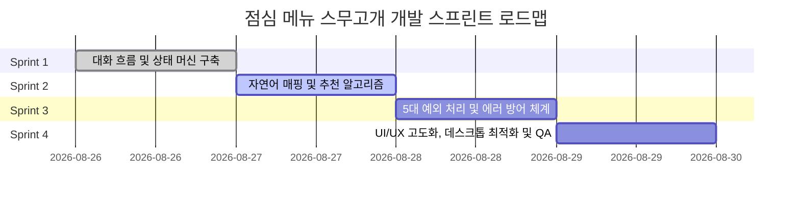

# 🚀 점심 메뉴 스무고개 마스터 개발 계획서 (Development Plan)

> **문서 버전**: v1.0.0  
> **기반 문서**: `PRD.md` (루트)  
> **작성일**: 2026-08-26  
> **프로젝트 성격**: 프론트엔드 전용 SPA (단일 화면 데스크톱 웹앱)

---

## 1. 프로젝트 개요 및 목표

### 1.1 프로젝트 목표
- AI와 사용자의 스무고개식 대화(질문-답변)를 통해 최적의 점심 메뉴 2가지(1순위, 2순위)를 추천하는 인터랙티브 웹 애플리케이션 개발.
- 최종 추천 결과에 대한 사용자 피드백(Yes/No)을 처리하고, No 선택 시 추가 질문(2턴)을 거쳐 정교한 재추천 제공.

### 1.2 핵심 성공 지표 (Success Criteria)
1. **대화 완결성**: 평균 7턴 내외의 직관적인 질의응답을 거쳐 최종 추천 화면 도달.
2. **최종 수락률(Yes)**: 추천 결과가 만족스러울 때 사용자 [Yes] 클릭으로 축하 화면(“축하합니다!”) 도달.
3. **예외 처리 견고성**: PRD에서 요구하는 **최소 5대 예외 처리** 완벽 구현 및 에러 시 화면 무중단 보장.
4. **프론트엔드 완결성**: 백엔드/DB/로그인/결제 의존성 없는 순수 클라이언트 기반 독립 실행.

---

## 2. PRD 제약사항 및 기술 아키텍처

### 2.1 제약 조건
| 항목 | 내용 |
|:---|:---|
| **화면 구성** | 단일 화면 SPA (Single Page Application), 데스크톱(1440×900 권장) 최적화 |
| **백엔드/DB** | 백엔드 API, 외부 DB, 인증/로그인, 결제 일체 없음 |
| **상태 관리** | React Client State 중심 (새로고침 시 초기화) |
| **입력 제약** | 사용자 입력 최대 50자 제한 (실시간 글자수 카운팅) |
| **외부 API** | 외부 지도/위치/LLM API 없음 (내장 텍스트 매칭 및 룰베이스 엔진) |

### 2.2 기술 스택 및 구조
- **Framework**: Next.js 14+ (App Router, Client Component 중심)
- **Styling**: Tailwind CSS + CSS Variables (Hues/Themes) + Lucide Icons
- **Language**: TypeScript (엄격한 타입 안전성 확보)
- **Architecture**:
  ```text
  [Idle Screen] ──(시작하기)──> [Chat Conversation Engine]
                                      │
                                (7턴 질의응답)
                                      ▼
                                [Result View] (1순위/2순위 추천)
                                ┌─────┴─────┐
                             [Yes]         [No]
                               │             │
                               ▼             ▼
                          [Done View]   [Followup Chat] (2턴 추가 질문)
                        (축하 애니메이션)     │
                                       (재추천 결과)
  ```

---

## 3. 스프린트 단위 개발 로드맵

총 4개의 스프린트로 구성되며, 각 스프린트는 독립적으로 검증 가능한 산출물을 도출합니다.



---

### 🏃 Sprint 1: 핵심 대화 인터랙션 & 상태 머신 (Core Interaction)
- **목표**: PRD 명세에 맞춘 대화 상태 흐름(State Machine) 완성과 턴 기반 질문/답변 인터랙션 구축
- **주요 태스크**:
  - 대화 페이즈 정의 (`idle` → `chat` → `recommending` → `result` → `done` / `followup`)
  - AI 질문 턴 전환 및 타이핑 애니메이션(Typing Bubble) 제어
  - 사용자 입력창(자유 입력 + 빠른 선택 칩 듀얼 모드) 동작
  - 대화 스크롤 자동 동기화 및 이전 질문 히스토리 렌더링
- **산출물**:
  - `components/lunch/lunch-app.tsx` (상태 머신 고도화)
  - `components/lunch/chat-input.tsx` (입력 편의성 개선)
- **상세 문서**: [Sprint 1 상세 계획](./sprints/sprint-1-core-interaction.md)

---

### 🏃 Sprint 2: 텍스트 분석 & 추천 알고리즘 고도화 (Recommendation Engine)
- **목표**: 사용자의 다양한 표현(인원, 분위기, 식성, 반박 등)을 반영하는 정교한 2가지 메뉴(1순위/2순위) 추천
- **주요 태스크**:
  - 메뉴 데이터셋 확장 (카테고리, 맛, 상황, 인원, 온도, 가격대 등 다차원 태깅)
  - 사용자 자유 입력 텍스트 형태소/키워드 매퍼 (`lib/keyword-mapper.ts`)
  - 점수 가중치 기반 메뉴 스코어링 알고리즘
  - 1순위/2순위 추천 메뉴와 추천 사유(위트 있는 공감 멘트) 생성
  - 1차 추천 거절([No]) 시 이전 메뉴 제외 및 2턴 추가 질문 기반 재추천 로직
- **산출물**:
  - `lib/lunch-data.ts` (메뉴 데이터베이스 및 태그 체계)
  - `lib/recommend-engine.ts` (추천 및 텍스트 매칭 엔진)
- **상세 문서**: [Sprint 2 상세 계획](./sprints/sprint-2-recommendation-engine.md)

---

### 🏃 Sprint 3: 5대 필수 예외 처리 & 안정성 확보 (Exception Handling)
- **목표**: PRD에서 요구한 5가지 핵심 예외 처리 및 비정상 입력 방어 체계 구현
- **주요 태스크**:
  1. **입력 50자 제한**: 50자 도달 시 입력 차단 및 실시간 시각 피드백 (경고 스타일)
  2. **빈 입력 방어**: 공백 또는 빈 문자열 전송 시 차단 및 인라인/토스트 안내 메시지 표시
  3. **응답 지연/타임아웃**: AI 답변 지연 시뮬레이션 및 "다시 시도하기" 재시도 버튼 노출
  4. **처리 중 로딩 표시**: "메뉴 추천 중..." 전용 로딩 인디케이터 및 인터랙션 비활성화
  5. **화면 무중단 보장 (Crash-proof)**: React Error Boundary 구현 및 데이터 소진 시 Fallback 추천
  6. *(추가)* 거친 표현/욕설 입력 시 위트 있는 방어 응답 및 대화 정상 유도
- **산출물**:
  - `components/lunch/error-boundary.tsx`
  - `components/lunch/timeout-fallback.tsx`
  - `lib/exception-guard.ts`
- **상세 문서**: [Sprint 3 상세 계획](./sprints/sprint-3-exception-handling.md)

---

### 🏃 Sprint 4: UI/UX 고도화, 데스크톱 최적화 및 종합 QA (Polish & QA)
- **목표**: PRD 디자인 브리프(1440×900 데스크톱 최적화, Idle 화면, 축하 화면) 충족 및 최종 E2E 검증
- **주요 태스크**:
  - 초기 화면 (Idle): “내가 점심 메뉴 추천해줌” 타이포 + “시작하기” CTA + 마스코트 일러스트
  - 결과 화면 (Result): 1순위/2순위 카드 UI 디자인 개선 + [Yes]/[No] 명확한 액션 배치
  - 완료 화면 (Done): “축하합니다!” 문구, 컨페티(Confetti) 폭죽 효과, 메뉴 확정 카드
  - 반응형 및 1440×900 데스크톱 뷰포트 최적화
  - 전체 사용자 시나리오 E2E 테스트 및 PRD 요구사항 검증표 대조
- **산출물**:
  - `components/lunch/idle-screen.tsx`
  - `components/lunch/result-view.tsx`
  - `components/lunch/confetti.tsx`
  - `docs/prd-traceability-matrix.md` (최종 완료 체크)
- **상세 문서**: [Sprint 4 상세 계획](./sprints/sprint-4-ui-ux-polish-qa.md)

---

## 4. 리스크 관리 방안

| 리스크 요인 | 영향도 | 대응 전략 |
|:---|:---:|:---|
| **자유 입력의 모호성** | 중 | 빠른 선택 칩을 기본 제공하고, 키워드 사전에 없는 입력도 위트 있는 공감 멘트로 부드럽게 넘어가도록 설계 |
| **추천 메뉴 소진 (연속 No)** | 낮음 | 제외 목록 누적 시에도 항상 최소 2개 이상의 메뉴를 반환할 수 있는 기본 추천 풀(Fallback Pool) 유지 |
| **타이머/비동기 메모리 누수** | 낮음 | 컴포넌트 언마운트 시 모든 `setTimeout`을 정리(cleanup)하는 커스텀 훅 및 상태 관리 적용 |
| **브라우저 새로고침 시 데이터 유실** | 낮음 | PRD 제약에 명시된 대로 클라이언트 메모리 기반(새로고침 시 초기화)을 기본 원칙으로 유지하며 초기화 버튼 제공 |

---

## 5. 변경 관리 및 스프린트 진행 가이드
- 각 스프린트 완료 시 `docs/sprints/` 내 해당 문서의 체크리스트를 갱신합니다.
- PRD 요구사항에 변동이 생기거나 추가 예외 케이스가 발견될 경우 `docs/prd-traceability-matrix.md`를 함께 업데이트합니다.
